# statusline-bar

A customizable statusline for Claude Code. One bash file and `jq` — no Node, no
Rust, no daemon, no network calls.

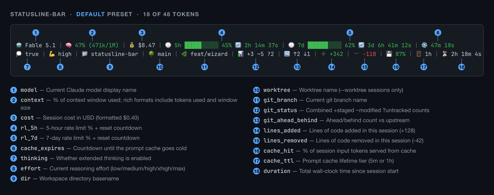

That is the `default` preset on a dark terminal — 18 of the 48 tokens available.
Here is the same statusline, same session, on a light one:

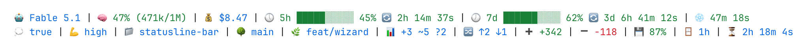

6 of the 21 themes are drawn for a light background and 3 more work on either, so
light terminals are a first-class target, not an afterthought.

<details>
<summary>Text-only version (copy-pasteable)</summary>

```
🤖 Fable 5.1 | 🧠 47% (471k/1M) | 💰 $8.47 | 🕔 5h █████░░░░░ 45% 🔄 2h 14m 37s | 🕖 7d ██████░░░░ 62% 🔄 3d 6h 41m 12s | ❄️ 47m 18s
💭 true | 💪 high | 📁 statusline-bar | 🌳 main | 🌿 feat/wizard | 📊 +3 ~5 ?2 | 🔀 ↑2 ↓1 | ➕ +342 | ➖ -118 | 💾 87% | 🪟 1h | ⏳ 2h 18m 4s
```

</details>

## Why

The Claude Code ecosystem already has a dozen good statuslines, each strong at
one thing. This is an attempt at one tool that does all of it:

- **Every useful field.** 48 tokens — model, cost, context, prompt-cache
  health, 5h and 7d rate limits with countdowns, git branch and status and
  ahead/behind, vim mode, agent name, session id, plus free local readouts like
  clock, battery, memory and load.
- **Good out of the box.** 12 presets, 21 themes, 12 progress-bar styles,
  truecolor when your terminal has it.
- **Trivial to install.** One file plus `jq`. Nothing to build, nothing running
  in the background.
- **Customizable to the last detail.** Up to 4 lines, any token in any order,
  and per-token overrides for prefix, format, bar style and separator.

A TUI wizard drives all of it, with a preview pane that re-renders as you move
the cursor. The config is plain JSON with a schema shipped alongside, so your
editor autocompletes it if you would rather type.

## Install

Clone it somewhere stable:

```bash
mkdir -p ~/.local/share
git clone https://github.com/Dworf/statusline-bar.git ~/.local/share/statusline-bar
chmod +x ~/.local/share/statusline-bar/statusline-bar.sh
```

Upgrade later with `cd ~/.local/share/statusline-bar && git pull`.

### Requirements

`bash` 3.2+ (already on your machine) and **`jq`**, which does all the JSON
work and is the one thing you may need to install:

| OS | Install |
|---|---|
| macOS | `brew install jq` |
| Debian / Ubuntu / WSL | `sudo apt install jq` |
| Fedora / RHEL | `sudo dnf install jq` |
| Arch | `sudo pacman -S jq` |
| Windows | `winget install jqlang.jq` (or `choco` / `scoop`) |

`jq --version` should print something like `jq-1.7.1`.

Optional: `git` for the git tokens, `fc-list` for Nerd Font detection, and
`pmset` or `/sys/class/power_supply` for the battery token. A
[Nerd Font](REFERENCE.md#nerd-fonts) unlocks three separators and two prefix
styles; everything else works without one.

### Wire it up in Claude Code

Claude Code reads **`~/.claude/settings.json`**. The whole file is one JSON
object — if it already has `model`, `permissions`, `hooks` and friends, **add
`statusLine` alongside them, don't overwrite the file**:

```json
{
  "model": "...",
  "permissions": { ... },
  "statusLine": {
    "type": "command",
    "command": "/Users/YOUR_USERNAME/.local/share/statusline-bar/statusline-bar.sh"
  }
}
```

Two things that trip people up:

- The path must be **absolute** — `~` and `$HOME` are not expanded. Paste the
  output of `realpath ~/.local/share/statusline-bar/statusline-bar.sh`. On
  Windows, use the WSL or Git Bash path.
- JSON has no trailing commas. If the key that used to be last had no comma
  after it, add one before appending `statusLine`.

Restart Claude Code and the statusline appears at the bottom. If it doesn't,
run the script by hand against the bundled sample payload — you should get a
populated two-line render:

```bash
~/.local/share/statusline-bar/statusline-bar.sh < ~/.local/share/statusline-bar/test/sample-input.json
```

## Configure

```bash
statusline-bar.sh -w        # or --wizard
```

The main menu has a row per global setting — preset, theme, prefix style,
separator, bar style, **Tokens & lines**, empty-data behavior, color depth —
over a live preview. `↑/↓` navigates, `←/→` cycles values in place, `Enter`
drills in, `Esc` goes back, `s` saves, `r` resets, `q` quits.

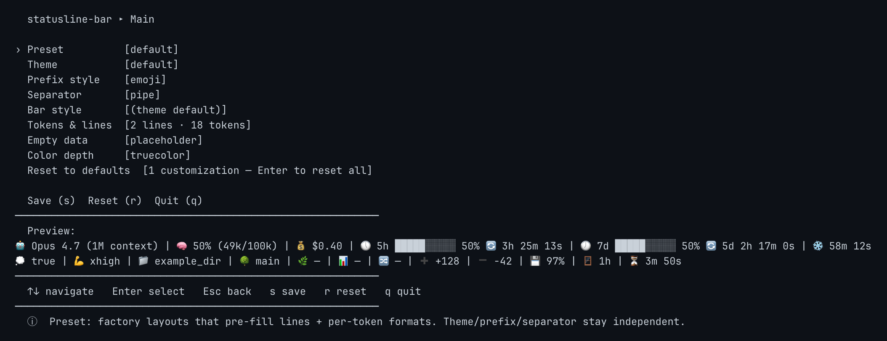

Every picker follows the same shape — options on the left, a per-option sample
on the right, the full statusline preview underneath. Nothing is a guess:

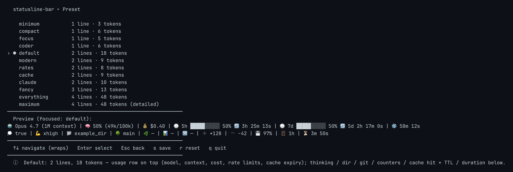

**Tokens & lines** is the layout editor: line tabs across the top (up to 4),
the token list with its separators inline below, preview at the bottom. `a`
adds a token, `c` changes one, `d` deletes, `Shift+↑/↓` reorders, `m`/`p` moves
a token to another line, and `Enter` on a token opens its per-token prefix /
format / bar-style overrides. Full keymap in the
[reference](REFERENCE.md#the-wizard).

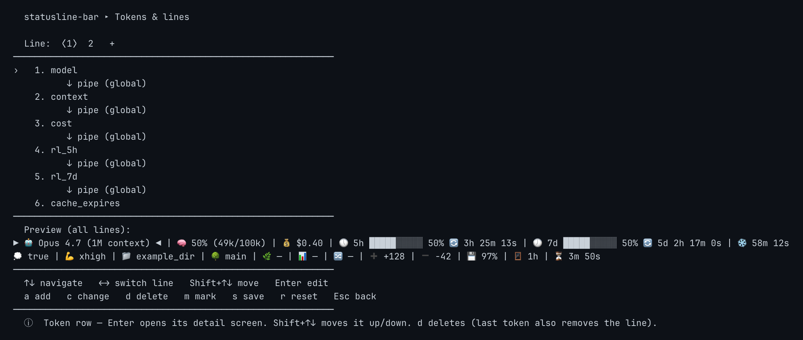

### Where your config lives

The wizard saves to the first of these that exists, and the script reads them
in the same order:

1. `--config PATH`
2. `$STATUSLINE_BAR_CONFIG`
3. `./.statusline-bar.json` in the session's workspace directory — pin a
   statusline per project
4. `$XDG_CONFIG_HOME/statusline-bar/config.json`
5. `~/.config/statusline-bar/config.json`
6. built-in defaults

### Tune it live

Keep the wizard open in one terminal and a real Claude Code session in another.
Press `s` and the config lands on disk; Claude Code picks it up on its next
statusline refresh and renders it against your *actual* data — real cost, real
countdowns, real git status — instead of the wizard's synthetic preview. To
force a refresh, type `/` in Claude Code and pick any slash command.

## What you can change

Twelve presets, from three tokens on one line to all 48 across four:

<table>
  <tr>
    <td><b>minimum</b><br></td>
    <td><b>focus</b><br></td>
  </tr>
  <tr>
    <td><b>coder</b><br></td>
    <td><b>compact</b><br></td>
  </tr>
  <tr>
    <td><b>cache</b><br>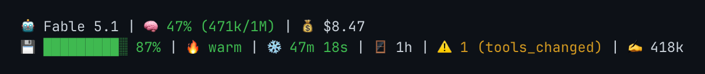</td>
    <td><b>modern</b><br>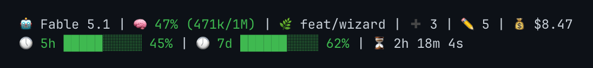</td>
  </tr>
  <tr>
    <td><b>rates</b> (dark theme)<br>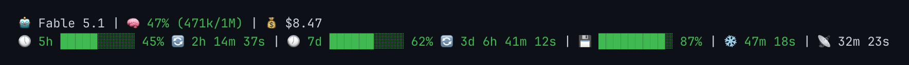</td>
    <td><b>fancy</b> (dark theme)<br>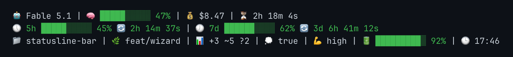</td>
  </tr>
</table>

And the same preset under three different prefix styles — every token's label
is swappable, globally or one at a time:

<table>
  <tr>
    <td align="center"><b>emoji</b> (default)</td>
    <td align="center"><b>ascii</b></td>
    <td align="center"><b>nerd</b></td>
  </tr>
  <tr>
    <td>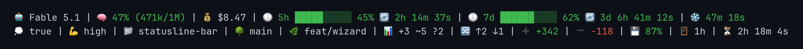</td>
    <td>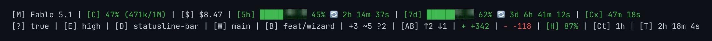</td>
    <td>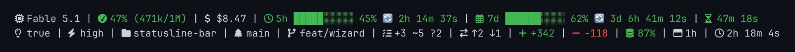</td>
  </tr>
</table>

| | |
|---|---|
| **48 tokens** | 35 from Claude Code's stdin JSON, 6 from `git`, 7 from the local machine |
| **12 presets** | 1-line `minimum` `compact` `focus` `coder` · 2-line `default` `modern` `rates` `cache` `claude` · 3-line `fancy` · 4-line `everything` `maximum` |
| **21 themes** | 3 adaptive, 6 for light terminals, 12 for dark |
| **8 prefix styles** | `none` `label` `emoji` `nerd` `ascii` and three combinations |
| **19 separators** | ASCII, Unicode, decorative, and Powerline glyphs |
| **12 bar styles** | 7 solid, 5 with sub-character precision |
| **27 formats** | bars, percentages, countdowns, compact model names, hourly cost projections, combined views — each token offers only the ones that fit its data |

To see all of it rendered in *your* terminal at *your* color depth:

```bash
statusline-bar.sh -e                  # the whole catalog
statusline-bar.sh -e themes           # one section: presets | themes | prefixes
                                      # | separators | bars | tokens
```

## More

- **[REFERENCE.md](REFERENCE.md)** — every catalog in full, the config schema,
  per-token overrides, and the complete CLI.
- **[CHANGELOG.md](CHANGELOG.md)** — release history.

## Contributing

Issues and PRs welcome at <https://github.com/Dworf/statusline-bar>.

Run the suite before submitting — 175 end-to-end cases, and they must all pass:

```bash
./test/run-tests.sh
```

If your change touches a token, preset, theme or catalog, regenerate the
screenshots too — see
[Regenerating the screenshots](REFERENCE.md#regenerating-the-screenshots).

## License

MIT — see [LICENSE](LICENSE).

## Acknowledgements

- **Anthropic**, for [Claude Code](https://claude.com/product/claude-code) and
  the open statusline interface that makes this possible.
