# Reference

Every catalog, the config schema, and the full CLI for
[statusline-bar](README.md) 0.6.0. All of it is also available live in your own
terminal — `statusline-bar.sh --examples [SECTION]` prints the same catalogs at
your terminal's real color depth. The showroom images below ship in light and
dark variants and switch with your GitHub theme.

- [Presets](#presets) · [Themes](#themes) · [Prefix styles](#prefix-styles) ·
  [Separators](#separators) · [Bar styles](#bar-styles) · [Tokens](#tokens) ·
  [Formats](#formats) · [Configuration](#configuration) ·
  [The wizard](#the-wizard) · [CLI](#cli) ·
  [Regenerating the screenshots](#regenerating-the-screenshots)

## Presets

A preset is a factory layout: which lines exist, which tokens sit on them, and
what format each uses. Selecting one replaces `lines`; per-token overrides you
set afterwards are kept.

| Preset | Shape | What it is for |
|---|---|---|
| `minimum` | 1 line · 3 tokens | model, context %, cost. Smallest possible statusline. |
| `compact` | 1 line · 6 tokens | minimum plus git branch, duration, and the 5h rate limit as a bare %. |
| `focus` | 1 line · 5 tokens | model + context + thinking/effort + cost. Quick activity glance. |
| `coder` | 1 line · 6 tokens | git-focused: model, branch, status, lines +/-, duration. |
| `default` | 2 lines · 18 tokens | usage row on top (model, context, cost, rate limits, cache expiry); thinking / dir / git / counters / cache hit + TTL / duration below. |
| `modern` | 2 lines · 9 tokens | git staged/modified inline; rate-limit bars + duration on line 2. |
| `rates` | 2 lines · 8 tokens | context + cost on top; rate limits with bars and countdowns, cache hit + expiry, and api time below. |
| `cache` | 2 lines · 9 tokens | context + cost on top; prompt-cache health (hit bar, warm, expiry, TTL, misses, writes) below. |
| `claude` | 2 lines · 10 tokens | session info + cost/duration; Claude state (thinking, effort, style, version) below. |
| `fancy` | 3 lines · 13 tokens | context bar, rate-limit bars, OS chrome (battery, clock), git status. |
| `everything` | 4 lines · 48 tokens | all 48 tokens, each in its default format. Coverage over compactness. |
| `maximum` | 4 lines · 48 tokens | the same 48 tokens, but with progress bars, countdowns, and combined views wherever a token offers them. |

<picture>
  <source media="(prefers-color-scheme: dark)" srcset="screenshots/showroom_presets_dark.png">
  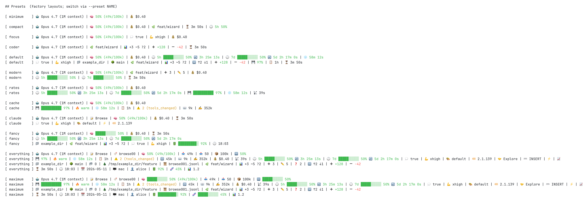
</picture>

## Themes

A theme is a palette of five colors — `good` / `warn` / `crit` for
threshold-colored values and bars, `dim` for placeholders, `accent` for
everything else — plus the bar style it suggests when `global.bar_style` is
`null`. Themes are grouped by the terminal background they were drawn for.

- **Auto / adaptive** (3) — `default`, `solarized`, `graphite`. `default`
  leaves the accent unset, so regular tokens inherit your terminal's foreground
  color; `graphite` is monochrome (bold / normal / dim) for anyone who wants
  emphasis without color.
- **Light terminals** (6) — `light`, `solarized-light`, `catppuccin-latte`,
  `tokyo-day`, `ayu-light`, `garden`
- **Dark terminals** (12) — `dark`, `dracula`, `nord`, `gruvbox`,
  `tokyo-night`, `catppuccin`, `one-dark`, `rose-pine`, `monokai`, `mocha`,
  `silver`, `ocean`

Each row below: the theme's good/warn/crit/text swatches, a model + context
render, then the same bar at 25 / 75 / 95%.

<picture>
  <source media="(prefers-color-scheme: dark)" srcset="screenshots/showroom_themes_dark.png">
  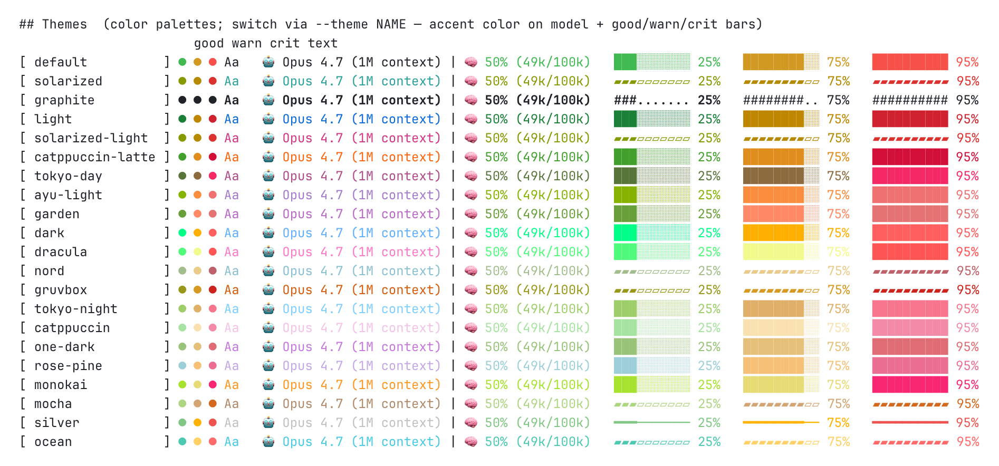
</picture>

## Prefix styles

The prefix is the label in front of a token's value. One style applies
globally; any token can override it with `tokens.<id>.prefix`.

| Style | `model` renders as |
|---|---|
| `none` | `Opus 4.7 (1M context)` |
| `label` | `Model: Opus 4.7 (1M context)` |
| `emoji` | `🤖 Opus 4.7 (1M context)` |
| `nerd` | *(Font Awesome glyph)* `Opus 4.7 (1M context)` |
| `ascii` | `[M] Opus 4.7 (1M context)` |
| `emoji+label` | `🤖 Model: Opus 4.7 (1M context)` |
| `label+emoji` | `Model 🤖 Opus 4.7 (1M context)` |
| `nerd+label` | *(glyph)* `Model: Opus 4.7 (1M context)` |

<picture>
  <source media="(prefers-color-scheme: dark)" srcset="screenshots/showroom_prefix_sets_dark.png">
  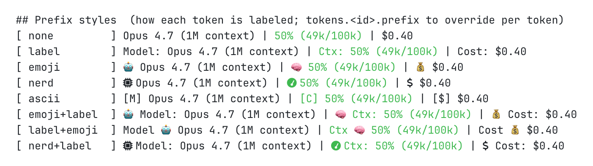
</picture>

A few prefixes track their value rather than just their token: `cache_warm`
renders 🔥 when the cache is warm and 🧊 when it has gone cold, and the `nerd`
style swaps fa-fire for fa-snowflake to match.

### Nerd Fonts

The `nerd` and `nerd+label` prefix styles and the `chevron` / `slant` /
`chevron_thin` separators need a [Nerd Font](https://www.nerdfonts.com/). The
wizard detects whether you have one and labels those options accordingly.
Without one, everything else still renders fine.

- **macOS**: `brew install --cask font-jetbrains-mono-nerd-font` — any Nerd
  Fonts cask works, pick the family you like
- **Debian / Ubuntu**: download a release zip from
  [nerd-fonts/releases](https://github.com/ryanoasis/nerd-fonts/releases),
  extract to `~/.local/share/fonts/`, then `fc-cache -f`
- **Arch**: `sudo pacman -S ttf-nerd-fonts-symbols` for symbols only, or any
  `ttf-*-nerd` package for a full family
- **Manual**: grab a zip from
  [nerdfonts.com/font-downloads](https://www.nerdfonts.com/font-downloads) and
  install it through your OS font manager

Then point your terminal at the patched variant (e.g. "JetBrainsMono Nerd
Font", not "JetBrainsMono") and restart it. The wizard's hint flips to
`Nerd Font ✓ detected`.

## Separators

The string drawn between two tokens on the same line. One separator applies
globally; `tokens.<id>.separator_after` overrides the one after that token.

| Family | Separators |
|---|---|
| ASCII (3) | `space` (two spaces), `pipe` ` \| `, `slash` ` / ` |
| Unicode (10) | `dot` ` · `, `vbar` ` │ `, `dash` ` ─ `, `bullet` ` • `, `diamond` ` ◆ `, `arrow` ` ▸ `, `tri` ` ▶ `, `star` ` ★ `, `sparkle` ` ✦ `, `gear` ` ⚙ ` |
| Decorative (3) | `check` ` ✓ `, `heart` ` ♥ `, `music` ` ♪ ` |
| Powerline / Nerd Font (3) | `chevron`, `slant`, `chevron_thin` — need a Nerd Font |

<picture>
  <source media="(prefers-color-scheme: dark)" srcset="screenshots/showroom_seperators_dark.png">
  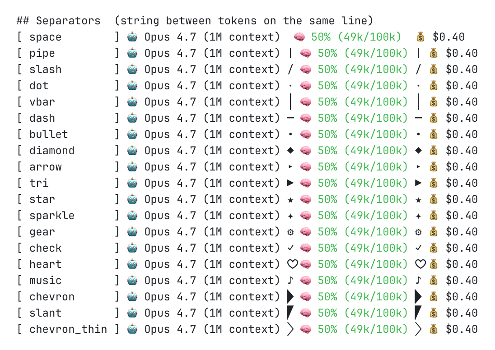
</picture>

## Bar styles

Progress bars are 10 cells wide by default (`global.bar_width`, 1–40) and take
their color from the theme's good / warn / crit thresholds. Seven styles fill
whole cells; five spend a partially-filled glyph on the boundary cell for
sub-character precision.

| Family | Styles | Fill / empty |
|---|---|---|
| Solid (7) | `blocks`, `heavy`, `line`, `braille`, `dots`, `arrows`, `ascii` | `█░`, `▰▱`, `━─`, `⣿⣀`, `●○`, `▶▷`, `#.` |
| Sub-character (5) | `gradient`, `gradient_dots`, `gradient_fade`, `gradient_shade`, `gradient_braille` | `█` plus eighth-block partials, over five different empty tracks |

Leave `global.bar_style` as `null` and each theme picks its own suggested
style. Any token with a bar can override it with `tokens.<id>.bar_style`.

<picture>
  <source media="(prefers-color-scheme: dark)" srcset="screenshots/showroom_barstyles_dark.png">
  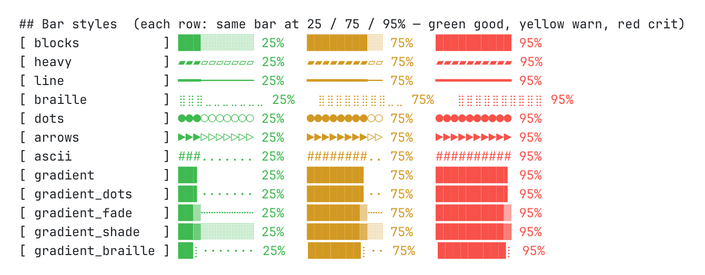
</picture>

## Tokens

48 tokens: 35 read out of the JSON Claude Code pipes in, 6 from `git`, 7 from
the machine running the statusline. Each token advertises only the formats that
make sense for its data; the **bold** one is its default.

<picture>
  <source media="(prefers-color-scheme: dark)" srcset="screenshots/showroom_tokens_dark.png">
  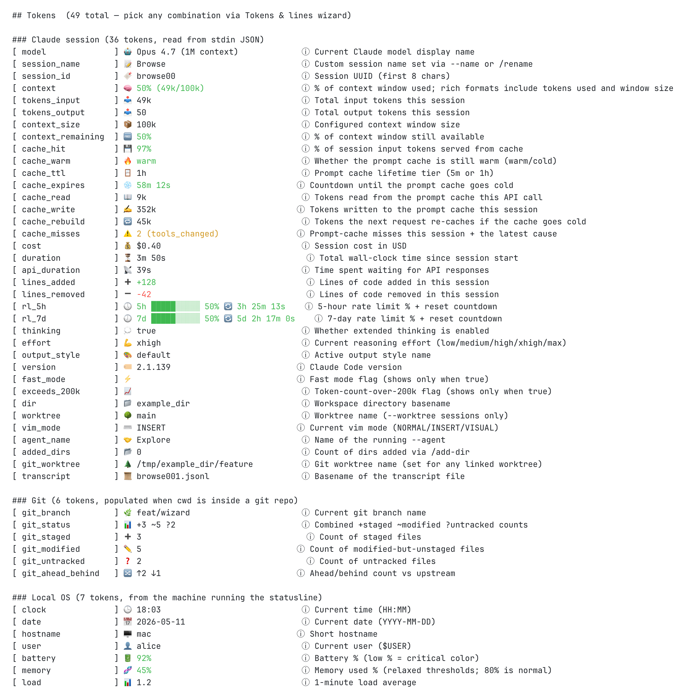
</picture>

### Claude session (35)

Read from stdin. A token whose field is absent from the payload renders the
placeholder (or disappears, under `empty_behavior: hide`) — that is what the
six `cache_*` tokens do on Claude Code versions older than 2.1.251, which do
not send a `prompt_cache` object.

| Token | Icon | Description | Formats |
|---|---|---|---|
| `model` | 🤖 | Current Claude model display name | **`value`** `compact` `short` `id` `id_short` |
| `session_name` | 📝 | Custom session name set via --name or /rename | **`value`** |
| `context` | 🧠 | % of context window used; rich formats include tokens used and window size | `value` `percent` `progressbar` `progressbar+percent` `tokens` `tokens+size` **`percent+tokens`** `progressbar+percent+tokens` |
| `tokens_input` | 📥 | Total input tokens this session | `value` **`short`** |
| `tokens_output` | 📤 | Total output tokens this session | `value` **`short`** |
| `context_size` | 📦 | Configured context window size | `value` **`short`** |
| `context_remaining` | 🆓 | % of context window still available | `value` **`percent`** `progressbar` `progressbar+percent` |
| `cache_hit` | 💾 | % of session input tokens served from cache | `value` **`percent`** `progressbar` `progressbar+percent` |
| `cache_warm` | 🔥 | Whether the prompt cache is still warm (warm/cold) | **`value`** `flag` |
| `cache_ttl` | 🪟 | Prompt cache lifetime tier (5m or 1h) | **`value`** |
| `cache_expires` | ❄️ | Countdown until the prompt cache goes cold | `value` **`countdown`** `countdown_short` `remaining` `remaining_short` |
| `cache_write` | ✍️ | Tokens written to the prompt cache this session | `value` **`short`** |
| `cache_rebuild` | 🔁 | Tokens the next request re-caches if the cache goes cold | `value` **`short`** |
| `cache_misses` | ⚠️ | Prompt-cache misses this session + the latest cause | `value` `cause` **`count+cause`** |
| `cost` | 💰 | Session cost in USD | **`value`** `per_hour` `with_rate` |
| `duration` | ⏳ | Total wall-clock time since session start | **`value`** `short` |
| `api_duration` | 📡 | Time spent waiting for API responses | **`value`** `short` |
| `lines_added` | ➕ | Lines of code added in this session | **`value`** `count` |
| `lines_removed` | ➖ | Lines of code removed in this session | **`value`** `count` |
| `rl_5h` | 🕔 | 5-hour rate limit % + reset countdown | `value` `percent` `progressbar` `progressbar+percent` `countdown` `countdown_short` `remaining` `remaining_short` **`progressbar+percent+countdown`** `progressbar+percent+countdown_short` `progressbar+percent+remaining` `progressbar+percent+remaining_short` |
| `rl_7d` | 🕖 | 7-day rate limit % + reset countdown | `value` `percent` `progressbar` `progressbar+percent` `countdown` `countdown_short` `remaining` `remaining_short` **`progressbar+percent+countdown`** `progressbar+percent+countdown_short` `progressbar+percent+remaining` `progressbar+percent+remaining_short` |
| `thinking` | 💭 | Whether extended thinking is enabled | **`value`** `flag` |
| `effort` | 💪 | Current reasoning effort (low/medium/high/xhigh/max) | **`value`** |
| `output_style` | 🎨 | Active output style name | **`value`** |
| `version` | 🏷️ | Claude Code version | **`value`** |
| `fast_mode` | ⚡️ | Fast mode flag (shows only when true) | **`flag`** `value` |
| `exceeds_200k` | 📈 | Token-count-over-200k flag (shows only when true) | **`flag`** `value` |
| `dir` | 📁 | Workspace directory basename | **`value`** |
| `worktree` | 🌳 | Worktree name (--worktree sessions only) | **`value`** |
| `vim_mode` | ⌨️ | Current vim mode (NORMAL/INSERT/VISUAL) | **`value`** |
| `agent_name` | 🤝 | Name of the running --agent | **`value`** |
| `session_id` | 🔖 | Session UUID (first 8 chars) | **`value`** |
| `added_dirs` | 📂 | Count of dirs added via /add-dir | **`value`** `flag` |
| `git_worktree` | 🌲 | Git worktree name (set for any linked worktree) | **`value`** |
| `transcript` | 📜 | Basename of the transcript file | **`value`** |

### Git (6)

Populated when the session's working directory is inside a git repo; empty
otherwise.

| Token | Icon | Description | Formats |
|---|---|---|---|
| `git_branch` | 🌿 | Current git branch name | **`value`** |
| `git_status` | 📊 | Combined +staged ~modified ?untracked counts | **`combined`** `value` |
| `git_staged` | ➕ | Count of staged files | **`value`** |
| `git_modified` | ✏️ | Count of modified-but-unstaged files | **`value`** |
| `git_untracked` | ❓ | Count of untracked files | **`value`** |
| `git_ahead_behind` | 🔀 | Ahead/behind count vs upstream | **`value`** |

### Local OS (7)

Read from the machine running the statusline. No network, no daemon — just
`date`, `uptime`, and the platform's battery/memory interfaces.

| Token | Icon | Description | Formats |
|---|---|---|---|
| `clock` | 🕒 | Current time (HH:MM) | **`value`** |
| `date` | 📅 | Current date (YYYY-MM-DD) | **`value`** |
| `hostname` | 🖥️ | Short hostname | **`value`** |
| `user` | 👤 | Current user ($USER) | **`value`** |
| `battery` | 🔋 | Battery % (low % = critical color) | `value` **`percent`** `progressbar` `progressbar+percent` |
| `memory` | 🧬 | Memory used % (relaxed thresholds; 80% is normal) | `value` **`percent`** `progressbar` `progressbar+percent` |
| `load` | 📊 | 1-minute load average | **`value`** |

## Formats

27 formats exist across the registry. Set one per token with
`tokens.<id>.format` — only the formats listed for that token above are valid.

| Format | Renders |
|---|---|
| `value` | the token's natural value — `$0.40`, `feat/wizard`, `50%` |
| `percent` | bare percentage |
| `progressbar` | bar only |
| `progressbar+percent` | bar then percentage |
| `flag` | the prefix alone, and only when the value is true |
| `short` | abbreviated — `49k` for counts, `3h 25m` for durations |
| `combined` | `git_status`'s `+3 ~5 ?2` roll-up |
| `count` | `lines_added` / `lines_removed` without the leading `+`/`-` |
| `compact` / `short` / `id` / `id_short` | `model`: drop " context" from the parens, drop the parens entirely, the raw model id, or a shortened id |
| `tokens` / `tokens+size` / `percent+tokens` / `progressbar+percent+tokens` | `context`: token count, token count + window size, and the combined views |
| `per_hour` / `with_rate` | `cost`: projected burn rate (`$6.20/hr`), or value plus rate |
| `cause` / `count+cause` | `cache_misses`: the latest diagnosed cause, with or without the count |
| `countdown` / `remaining` | time until a reset, and the same as a remaining-time reading |
| `countdown_short` / `remaining_short` | as above at top-two-unit precision — `3h 25m`, not `3h 25m 13s` |
| `progressbar+percent+countdown` (and `_short`) | rate limits: bar, percentage, and countdown in one token |
| `progressbar+percent+remaining` (and `_short`) | same, with the remaining-time wording |

## Configuration

The config file is JSON. The wizard writes it for you; everything below is what
it writes, and is equally editable by hand.

The lookup order is documented in the README — see
[Where your config lives](README.md#where-your-config-lives).

```json
{
  "$schema": "https://raw.githubusercontent.com/Dworf/statusline-bar/main/schema.json",
  "version": 1,
  "preset": "default",
  "theme": "default",
  "global": {
    "prefix_style": "emoji",
    "separator": "pipe",
    "bar_style": null,
    "color_depth": "auto",
    "empty_behavior": "placeholder",
    "placeholder": "—",
    "bar_width": 10
  },
  "lines": [
    ["model", "context", "cost", "rl_5h", "rl_7d", "cache_expires"],
    ["thinking", "effort", "dir", "worktree", "git_branch", "git_status",
     "git_ahead_behind", "lines_added", "lines_removed", "cache_hit",
     "cache_ttl", "duration"]
  ],
  "tokens": {}
}
```

| Key | Values |
|---|---|
| `version` | `1` |
| `preset` | any preset name, or `null` once you have hand-edited `lines` |
| `theme` | any theme name |
| `global.prefix_style` | any prefix style |
| `global.separator` | any separator |
| `global.bar_style` | any bar style, or `null` to follow the theme |
| `global.color_depth` | `auto`, `truecolor`, `256`, `16`, `none` |
| `global.empty_behavior` | `placeholder` (default) or `hide` |
| `global.placeholder` | the string an empty token renders as — `—` by default |
| `global.bar_width` | cells per progress bar, 1–40 |
| `lines` | 1–4 arrays of token ids, in render order |
| `tokens` | per-token overrides, keyed by token id |

Each entry under `tokens` may set `prefix`, `format`, `bar_style`, and
`separator_after`, each overriding the corresponding global for that one token:

```json
"tokens": {
  "cost":  { "format": "with_rate", "separator_after": "star" },
  "rl_5h": { "format": "progressbar+percent+remaining_short", "bar_style": "gradient" },
  "dir":   { "prefix": "label" }
}
```

Color depth is detected automatically — truecolor, 256, 16, or none — and
`$NO_COLOR` is honored. Thresholds come from the theme, with per-token rules
where the plain reading would mislead: `battery` and `context_remaining` invert
(low is critical), `cache_hit` treats high as good, and `memory` uses a relaxed
table where 80% is still normal.

The generated config carries a `$schema` pointing at this repo's
[`schema.json`](schema.json), so VS Code, Cursor, JetBrains, and Neovim's LSP
give you autocomplete and inline docs while you edit. Validate a file at any
time:

```bash
statusline-bar.sh --check --config path/to/config.json
```

## The wizard

`statusline-bar.sh -w` edits the config it loaded, and saves back to the same
path. Every screen carries a breadcrumb and a live preview; the focused token
or separator is underlined and wrapped in `▶ ◀` markers so its real colors stay
visible.

| Key | Everywhere |
|---|---|
| `↑` `↓` | move; wraps at both ends |
| `←` `→` | cycle a value in place, where the row supports it |
| `Enter` | drill into the focused row |
| `Esc` | back one level |
| `s` | save — flashes a confirmation and leaves you where you were |
| `r` | reset, scoped to the current screen |
| `q` | quit; prompts if you have unsaved changes |

| Key | Tokens & lines |
|---|---|
| `←` `→` | switch line, including the `+` tab that adds one (up to 4) |
| `a` `c` `d` | add a token, change the one at the cursor, delete it |
| `Shift+↑` `Shift+↓` | move a token within its line |
| `m` `p` | mark a token, then paste it onto another line |
| `d` on a line tab | delete the line, with confirmation if it is not empty |
| `Enter` on a separator row | pick a separator for that one position |

<details>
<summary>Every wizard screen</summary>

Pickers for the global settings — theme, prefix style, separator, bar style:

<table>
  <tr>
    <td>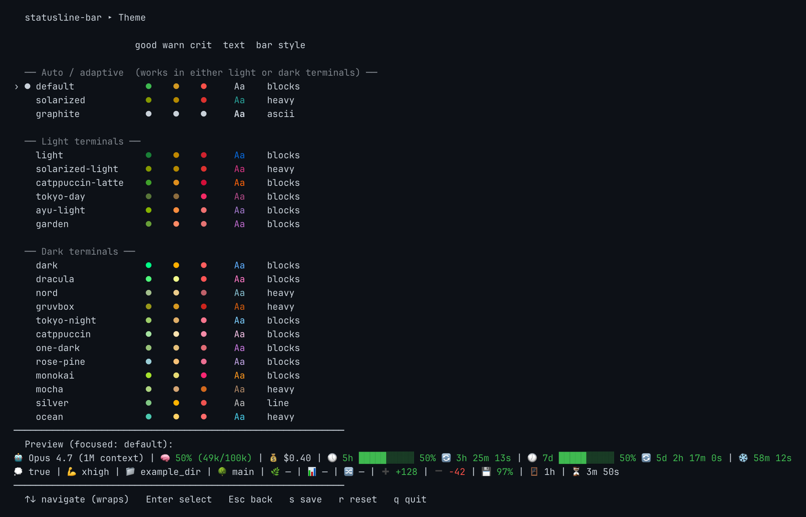</td>
    <td>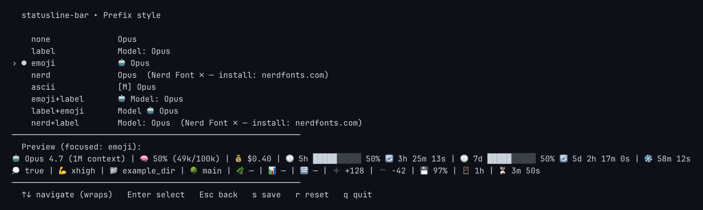</td>
  </tr>
  <tr>
    <td>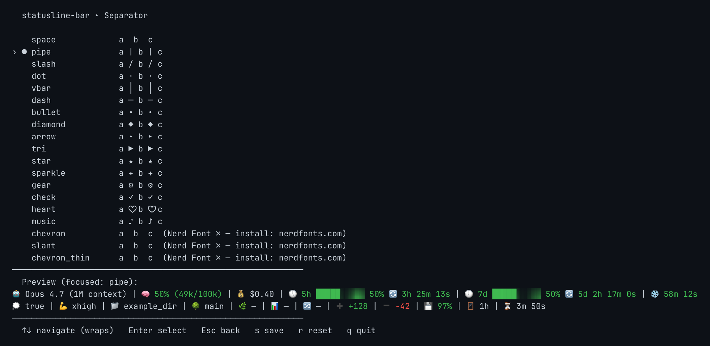</td>
    <td>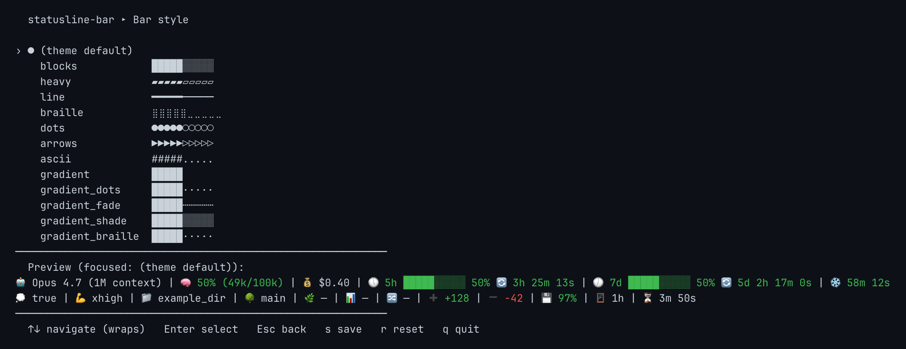</td>
  </tr>
</table>

Per-token overrides — open a token from **Tokens & lines** and each sub-picker
renders that actual token under every option:

<table>
  <tr>
    <td>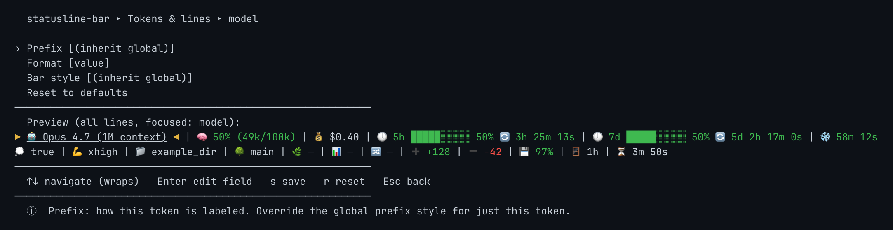</td>
    <td>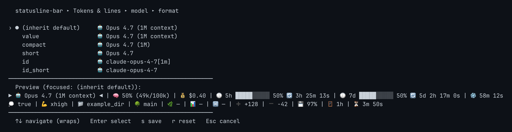</td>
  </tr>
  <tr>
    <td>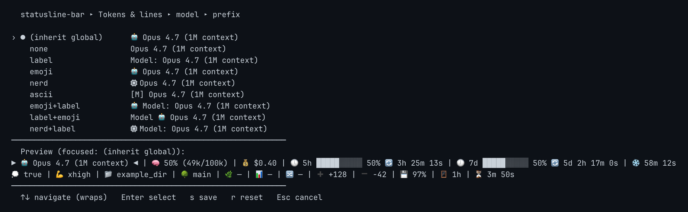</td>
    <td>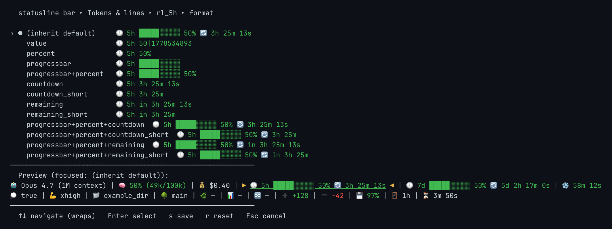</td>
  </tr>
</table>

`a` from any line opens the token picker: all 48 grouped by source, each row a
live sample, with `✓` next to the ones already placed somewhere.

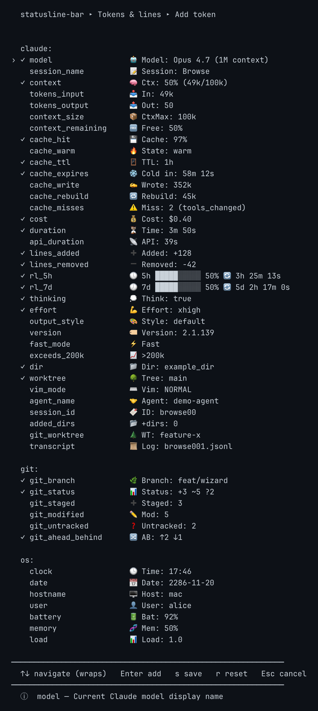

</details>

## CLI

```text
statusline-bar.sh [FLAGS]            render from stdin (Claude Code mode)
statusline-bar.sh -w | --wizard      interactive setup
statusline-bar.sh -e | --examples    print a catalog of presets/themes/etc
statusline-bar.sh -c | --check       validate config; exit 0/1

Flags:
  -h, --help                show help
  -V, --version             print version
  -w, --wizard              enter setup wizard
  -e, --examples            print the catalog
  -c, --check               validate config and exit
      --config PATH         use this config file instead of default
      --preset NAME         one-shot render with this preset
      --theme NAME          one-shot render with this theme
      --no-color            disable ANSI color output
```

`--examples` takes an optional section — `presets`, `themes`, `prefixes`,
`separators`, `bars`, `tokens` — to print just that one. It renders at your
terminal's real color depth, so themes visibly differ. Pipe through `less -R`
to page it with ANSI intact.

With no flags and no stdin the script prints its help. When JSON arrives on
stdin — which is how Claude Code calls it — it renders the statusline.

### Environment

| Variable | Effect |
|---|---|
| `STATUSLINE_BAR_CONFIG` | config path, second in the lookup order |
| `STATUSLINE_BAR_DEBUG_INPUT` | where to mirror the stdin payload; `off` disables it |
| `NO_COLOR` | any value disables ANSI color |

### Inspecting the input JSON

Every render mirrors the raw stdin JSON to `/tmp/statusline-bar-input.json`
(overwritten each time, owner-readable only), so you can always see exactly
what Claude Code piped in last — useful for spotting new or changed fields
between Claude Code versions:

```sh
jq . /tmp/statusline-bar-input.json
```

The write is best-effort and can never break a render. Point
`STATUSLINE_BAR_DEBUG_INPUT` elsewhere to relocate the file, or set it to `off`
to turn it off. With several concurrent sessions the file holds whichever one
rendered last.

## Regenerating the screenshots

Every PNG under `screenshots/` is generated from real script output by
`tools/shots.sh`, which renders tokens under the same pinned environment the
e2e suite uses, converts the ANSI to HTML, and screenshots it in headless
Chrome. Two runs of the same recipe produce byte-identical files.

```bash
tools/shots.sh              # rebuild every recipe
tools/shots.sh --list       # hero, presets, showrooms, menus
tools/shots.sh showrooms    # rebuild one recipe
```

If you add or change a token, a preset, or a theme, rerun it so the catalogs in
this file stay honest. It needs headless Chrome, which is a maintainer-machine
concern — the shipped script itself still needs nothing beyond bash and `jq`.
